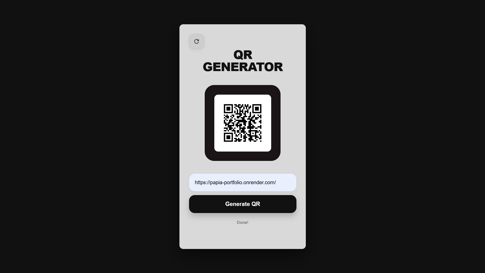

# ⬛ PyPixel-QR 🐍

**PyPixel-QR** is a modern, minimalist QR code generator that bridges the gap between Python logic and web design. Unlike traditional web apps, PyPixel runs a full Python engine directly in your browser using **WebAssembly (Pyodide)**.

[](https://YOUR_GITHUB_USERNAME.github.io/PyPixel-QR/)

---

## ✨ Why PyPixel?
* **Pure Python:** Uses the `qrcode` and `Pillow` libraries entirely client-side.
* **Premium UI:** A "squircle" inspired mobile-first design that feels like a native app.
* **Zero Server Lag:** Since there is no backend server (like Flask or Django), your data stays in your browser and generation is near-instant.
* **Desktop & Mobile Optimized:** Responsive layout that looks great on any device.

---

## 📸 Preview

<p align="center">
  
</p>

---

## 🛠️ How It Works
PyPixel uses **Pyodide** to fetch and run `logic.py`. When you click generate:
1. **Environment Setup:** The browser-side Python engine installs the necessary imaging libraries (`qrcode`, `pillow`).
2. **Logic Processing:** It processes your text or URL into a data matrix using Python.
3. **Rendering:** It "draws" the QR code as a PNG in memory and converts it to a Base64 string.
4. **Instant Update:** The HTML interface displays the result without ever refreshing the page.

---

## 🚀 Deployment
This project is hosted for free on **GitHub Pages**. 

### Local Setup
1. Clone the repository.
2. Ensure `index.html` and `logic.py` are in the same folder.
3. Because of browser security (CORS), run a local server to view:
   ```bash
   # If you have Python installed locally
   python -m http.server 8000
